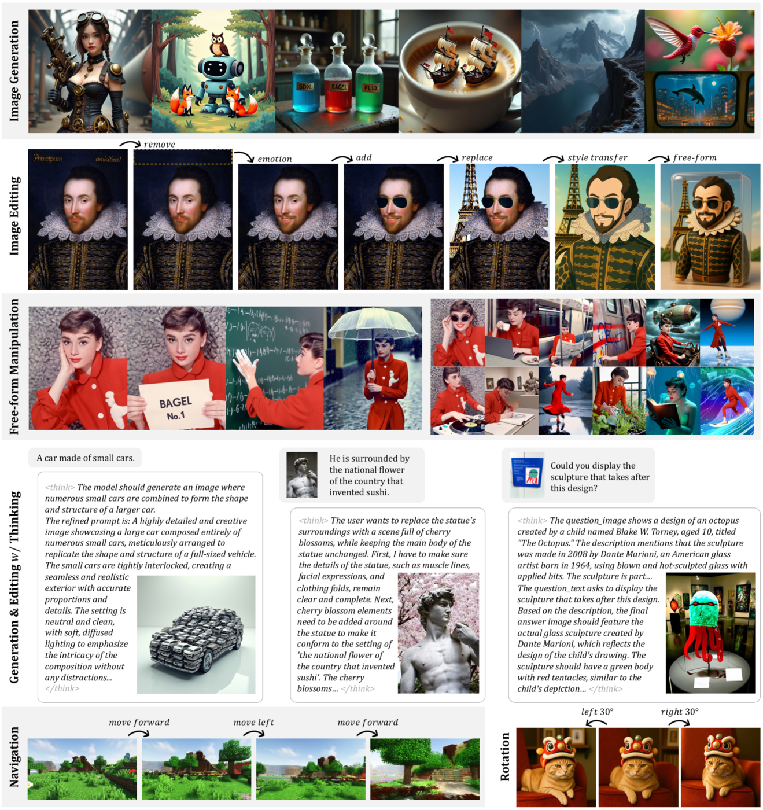
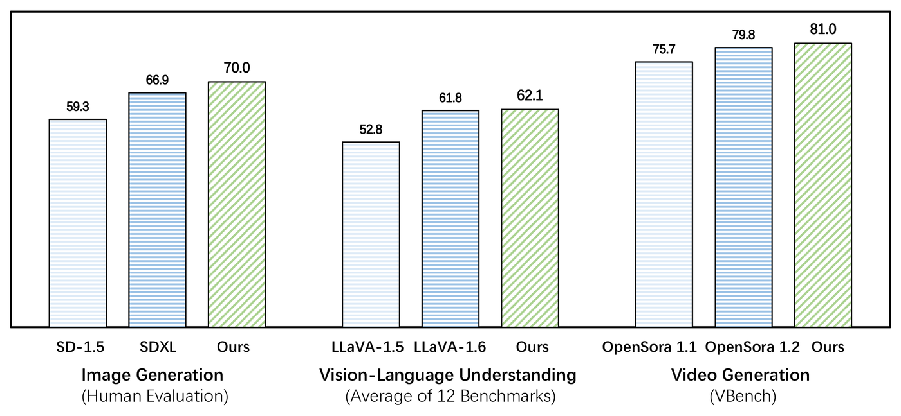
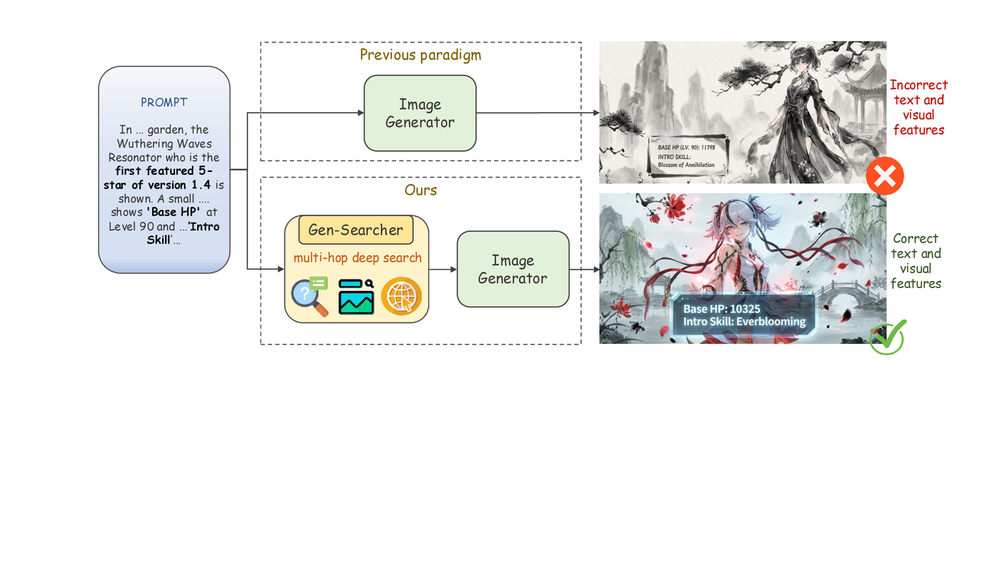
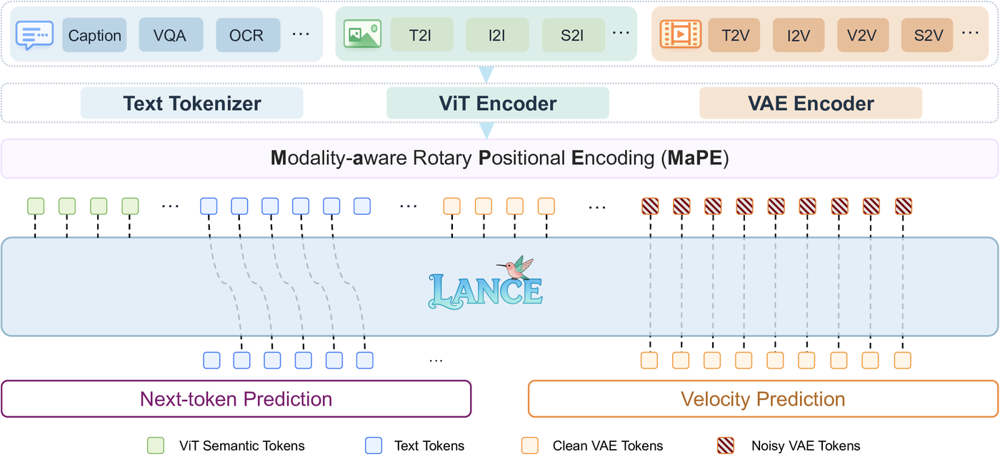
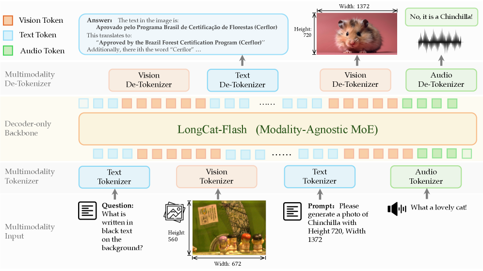
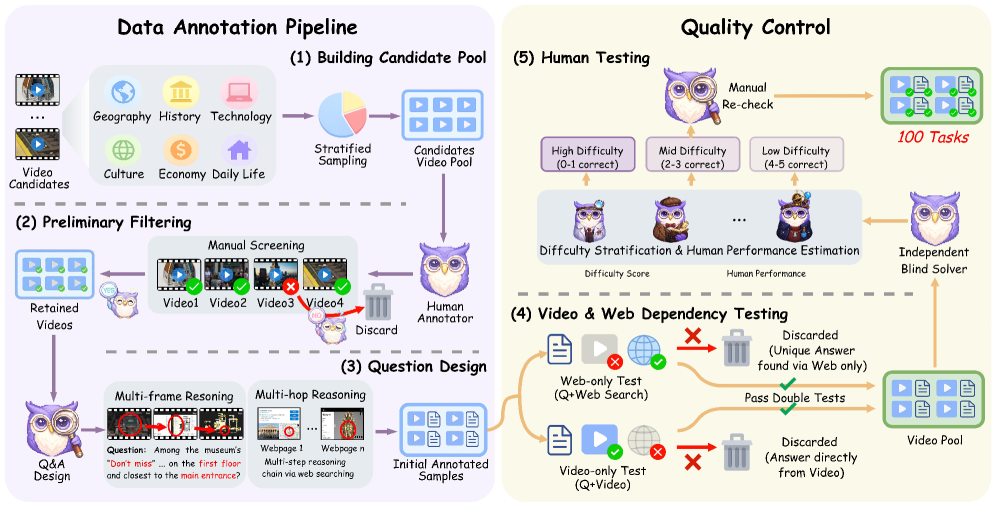
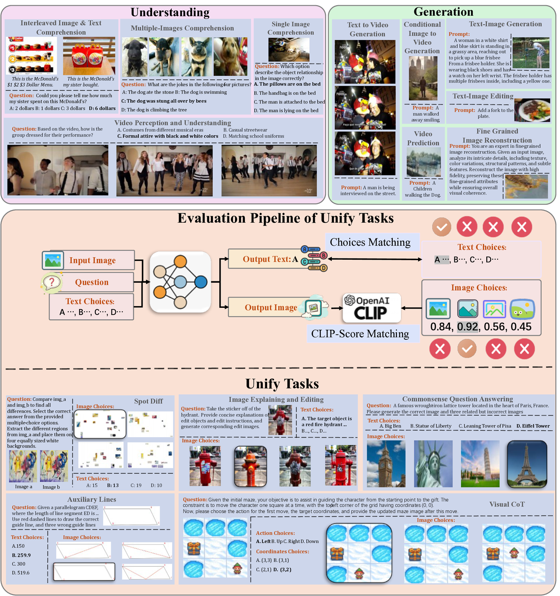
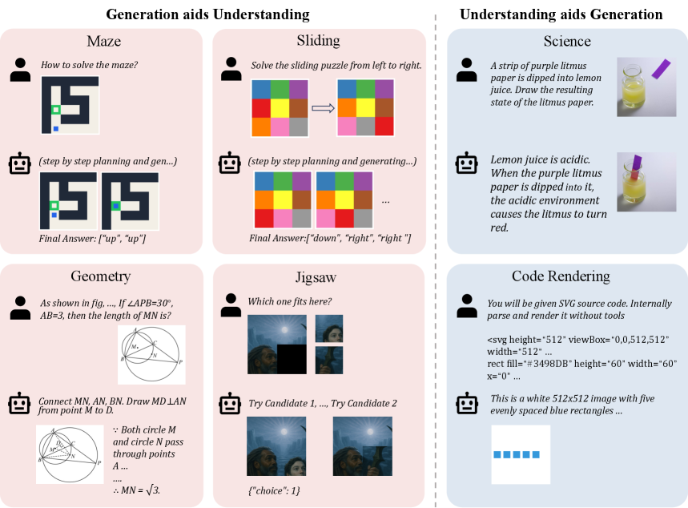

# Awesome UMM Papers

A curated list of papers on unified multimodal models, agents, and native multimodal pretraining.

GitHub stars are live Shields.io badges. Citation counts are Google Scholar counts checked manually; they are not mixed with Semantic Scholar or OpenAlex counts because those sources use different coverage and can mismatch newly released arXiv papers.

**Title:** Emerging Properties in Unified Multimodal Pretraining  
**Acceptance:** arXiv preprint, 2025  
**GitHub:**  [ByteDance-Seed/Bagel](https://github.com/ByteDance-Seed/Bagel)  
**Citations:** [525](https://scholar.google.com/scholar?q=%22Emerging%20Properties%20in%20Unified%20Multimodal%20Pretraining%22) (Google Scholar, checked 2026-05-20)  
**Paper:** [alphaXiv:2505.14683](https://www.alphaxiv.org/abs/2505.14683)  
**Figure:** Showcase of the versatile abilities of the BAGEL model.  

**Authors:** Chaorui Deng, Deyao Zhu, Kunchang Li, Chenhui Gou, Feng Li, Zeyu Wang, Shu Zhong, Weihao Yu, Xiaonan Nie, Ziang Song, Guang Shi, Haoqi Fan  
**Affiliations:** ByteDance Seed, Shenzhen Institutes of Advanced Technology, Monash University, HKUST, UC Santa Cruz

---

**Title:** Emu3: Next-Token Prediction is All You Need  
**Acceptance:** Nature 2026  
**GitHub:**  [baaivision/Emu3](https://github.com/baaivision/Emu3)  
**Citations:** [683](https://scholar.google.com/scholar?q=%22Emu3%3A%20Next-Token%20Prediction%20is%20All%20You%20Need%22) (Google Scholar, checked 2026-05-20)  
**Paper:** [alphaXiv:2409.18869](https://www.alphaxiv.org/abs/2409.18869)  
**Publication:** [Published version: Multimodal learning with next-token prediction for large multimodal models](https://www.nature.com/articles/s41586-025-10041-x)  
**Figure:** Comparison with open-source flagship models in vision generation and perception.  

**Authors:** Emu3 Team  
**Affiliations:** BAAI

---

**Title:** Gen-Searcher: Reinforcing Agentic Search for Image Generation  
**Acceptance:** arXiv preprint, 2026  
**GitHub:**  [tulerfeng/Gen-Searcher](https://github.com/tulerfeng/Gen-Searcher)  
**Citations:** [6](https://scholar.google.com/scholar?q=%22Gen-Searcher%3A%20Reinforcing%20Agentic%20Search%20for%20Image%20Generation%22) (Google Scholar, checked 2026-05-20)  
**Paper:** [alphaXiv:2603.28767](https://www.alphaxiv.org/abs/2603.28767)  
**Figure:** Gen-Searcher enables search-grounded generation in real-world knowledge-intensive scenarios.  

**Authors:** Kaituo Feng, Manyuan Zhang, Shawn Chen, Yunlong Lin, Kaixuan Fan, Yilei Jiang, Hongyu Li, Dian Zheng, Chenyang Wang, Xiangyu Yue  
**Affiliations:** MMLab, CUHK, UCLA, UC Berkeley

---

**Title:** Lance: Unified Multimodal Modeling by Multi-Task Synergy  
**Acceptance:** arXiv preprint, 2026  
**GitHub:**  [bytedance/Lance](https://github.com/bytedance/Lance)  
**Citations:** [0](https://scholar.google.com/scholar?q=%22Lance%3A%20Unified%20Multimodal%20Modeling%20by%20Multi-Task%20Synergy%22) (Google Scholar, checked 2026-05-20)  
**Paper:** [alphaXiv:2605.18678](https://www.alphaxiv.org/abs/2605.18678)  
**Figure:** Overview of Lance's unified multimodal context modeling and dual-expert backbone.  

**Authors:** Fengyi Fu, Mengqi Huang, Shaojin Wu, Yunsheng Jiang, Yufei Huo, Hao Li, Yinghang Song, Fei Ding, Jianzhu Guo, Qian He, Zheren Fu, Zhendong Mao, Yongdong Zhang  
**Affiliations:** Intelligent Creation Lab, ByteDance

---

**Title:** LongCat-Next: Lexicalizing Modalities as Discrete Tokens  
**Acceptance:** arXiv preprint, 2026  
**GitHub:**  [meituan-longcat/LongCat-Next](https://github.com/meituan-longcat/LongCat-Next)  
**Citations:** [5](https://scholar.google.com/scholar?q=%22LongCat-Next%3A%20Lexicalizing%20Modalities%20as%20Discrete%20Tokens%22) (Google Scholar, checked 2026-05-20)  
**Paper:** [alphaXiv:2603.27538](https://www.alphaxiv.org/abs/2603.27538)  
**Figure:** Overview of the LongCat-Next architecture under the Discrete Native Autoregression paradigm.  

**Authors:** Meituan LongCat Team  
**Affiliations:** Meituan

---

**Title:** Unify-Agent: A Unified Multimodal Agent for World-Grounded Image Synthesis  
**Acceptance:** arXiv preprint, 2026  
**GitHub:**  [shawn0728/Unify-Agent](https://github.com/shawn0728/Unify-Agent)  
**Citations:** [4](https://scholar.google.com/scholar?q=%22Unify-Agent%3A%20A%20Unified%20Multimodal%20Agent%20for%20World-Grounded%20Image%20Synthesis%22) (Google Scholar, checked 2026-05-20)  
**Paper:** [alphaXiv:2603.29620](https://www.alphaxiv.org/abs/2603.29620)  
**Figure:** High-quality Unify-Agent samples showing unified multi-image generation and world-knowledge grounding.  

**Authors:** Shawn Chen, Quanxin Shou, Hangting Chen, Yucheng Zhou, Kaituo Feng, Wenbo Hu, Yi-Fan Zhang, Yunlong Lin, Wenxuan Huang, Mingyang Song, Dasen Dai, Bolin Jiang, Manyuan Zhang, Shi-Xue Zhang, Zhengkai Jiang, Lucas Wang, Zhao Zhong, Yu Cheng, Nanyun Peng  
**Affiliations:** UCLA, Tencent Hunyuan, CUHK, HKUST

---

**Title:** Watching, Reasoning and Searching: A Video Deep Research Benchmark on Open Web for Agentic Video Reasoning  
**Acceptance:** arXiv preprint, 2026  
**GitHub:**  [QuantaAlpha/VideoDR-Benchmark](https://github.com/QuantaAlpha/VideoDR-Benchmark)  
**Citations:** [2](https://scholar.google.com/scholar?q=%22Watching%2C%20Reasoning%20and%20Searching%3A%20A%20Video%20Deep%20Research%20Benchmark%20on%20Open%20Web%20for%20Agentic%20Video%20Reasoning%22) (Google Scholar, checked 2026-05-20)  
**Paper:** [alphaXiv:2601.06943](https://www.alphaxiv.org/abs/2601.06943)  
**Figure:** Overview of the VideoDR construction pipeline.  

**Authors:** Chengwen Liu, Xiaomin Yu, Zhuoyue Chang, Zhe Huang, Shuo Zhang, Heng Lian, Kunyi Wang, Rui Xu, Sen Hu, Jianheng Hou, Hao Peng, Chengwei Qin, Xiaobin Hu, Hong Peng, Ronghao Chen, Huacan Wang  
**Affiliations:** LZU, HKUST(GZ), UBC, FDU, PKU, USC, NUS, UCAS, HKUST, QuantaAlpha

---

**Title:** MME-Unify: A Comprehensive Benchmark for Unified Multimodal Understanding and Generation Models  
**Acceptance:** ICLR 2026  
**GitHub:**  [MME-Benchmarks/MME-Unify](https://github.com/MME-Benchmarks/MME-Unify)  
**Citations:** [24](https://scholar.google.com/scholar?q=%22MME-Unify%3A%20A%20Comprehensive%20Benchmark%20for%20Unified%20Multimodal%20Understanding%20and%20Generation%20Models%22) (Google Scholar, checked 2026-05-20)  
**Paper:** [alphaXiv:2504.03641](https://www.alphaxiv.org/abs/2504.03641)  
**Publication:** [OpenReview: ICLR 2026 Poster](https://openreview.net/forum?id=7x6TxVIarj)  
**Figure:** MME-Unify benchmark diagram covering understanding, generation, and unified tasks.  

**Authors:** Wulin Xie, Yi-Fan Zhang, Chaoyou Fu, Yang Shi, Bingyan Nie, Hongkai Chen, Zhang Zhang, Liang Wang, Tieniu Tan  
**Affiliations:** CASIA, NJU, PKU, Vivo, M-M-E

---

**Title:** Uni-MMMU: A Massive Multi-discipline Multimodal Unified Benchmark  
**Acceptance:** arXiv preprint, 2025  
**GitHub:**  [Vchitect/Uni-MMMU](https://github.com/Vchitect/Uni-MMMU)  
**Citations:** [16](https://scholar.google.com/scholar?q=%22Uni-MMMU%3A%20A%20Massive%20Multi-discipline%20Multimodal%20Unified%20Benchmark%22) (Google Scholar, checked 2026-05-20)  
**Paper:** [alphaXiv:2510.13759](https://www.alphaxiv.org/abs/2510.13759)  
**Figure:** Overview of Uni-MMMU's bidirectional generation-understanding task paradigms.  

**Authors:** Kai Zou, Ziqi Huang, Yuhao Dong, Shulin Tian, Dian Zheng, Hongbo Liu, Jingwen He, Bin Liu, Yu Qiao, Ziwei Liu  
**Affiliations:** Shanghai Artificial Intelligence Laboratory, S-Lab at NTU, USTC, CUHK

---

**Title:** WebWalker: Benchmarking LLMs in Web Traversal  
**Acceptance:** ACL 2025  
**GitHub:**  [Alibaba-NLP/WebAgent](https://github.com/Alibaba-NLP/WebAgent)  
**Citations:** [N/A](https://scholar.google.com/scholar?q=%22WebWalker%3A%20Benchmarking%20LLMs%20in%20Web%20Traversal%22) (Google Scholar, unchecked)  
**Paper:** [alphaXiv:2501.07572](https://www.alphaxiv.org/abs/2501.07572)  
**Publication:** [ACL Anthology: ACL 2025 Long Paper](https://aclanthology.org/2025.acl-long.508/)  
**Authors:** Jialong Wu, Wenbiao Yin, Yong Jiang, Zhenglin Wang, Zekun Xi, Runnan Fang, Linhai Zhang, Yulan He, Deyu Zhou, Pengjun Xie, Fei Huang  
**Affiliations:** Tongyi Lab, Alibaba Group

---

**Title:** WebDancer: Towards Autonomous Information Seeking Agency  
**Acceptance:** NeurIPS 2025  
**GitHub:**  [Alibaba-NLP/WebAgent](https://github.com/Alibaba-NLP/WebAgent)  
**Citations:** [N/A](https://scholar.google.com/scholar?q=%22WebDancer%3A%20Towards%20Autonomous%20Information%20Seeking%20Agency%22) (Google Scholar, unchecked)  
**Paper:** [alphaXiv:2505.22648](https://www.alphaxiv.org/abs/2505.22648)  
**Publication:** [OpenReview paper page](https://openreview.net/pdf?id=quJdphBcdP)  
**Authors:** Jialong Wu, Baixuan Li, Runnan Fang, Wenbiao Yin, Liwen Zhang, Zhengwei Tao, Dingchu Zhang, Zekun Xi, Gang Fu, Yong Jiang, Pengjun Xie, Fei Huang, Jingren Zhou  
**Affiliations:** Tongyi Lab, Alibaba Group

---

**Title:** WebSailor: Navigating Super-human Reasoning for Web Agent  
**Acceptance:** arXiv preprint, 2025  
**GitHub:**  [Alibaba-NLP/WebAgent](https://github.com/Alibaba-NLP/WebAgent)  
**Citations:** [N/A](https://scholar.google.com/scholar?q=%22WebSailor%3A%20Navigating%20Super-human%20Reasoning%20for%20Web%20Agent%22) (Google Scholar, unchecked)  
**Paper:** [alphaXiv:2507.02592](https://www.alphaxiv.org/abs/2507.02592)  
**Authors:** Kuan Li, Zhongwang Zhang, Huifeng Yin, Liwen Zhang, Litu Ou, Jialong Wu, Wenbiao Yin, Baixuan Li, Zhengwei Tao, Xinyu Wang, Weizhou Shen, Junkai Zhang, Dingchu Zhang, Xixi Wu, Yong Jiang, Ming Yan, Pengjun Xie, Fei Huang, Jingren Zhou  
**Affiliations:** Tongyi Lab, Alibaba Group

---

**Title:** WebShaper: Agentically Data Synthesizing via Information-Seeking Formalization  
**Acceptance:** arXiv preprint, 2025  
**GitHub:**  [Alibaba-NLP/WebAgent](https://github.com/Alibaba-NLP/WebAgent)  
**Citations:** [N/A](https://scholar.google.com/scholar?q=%22WebShaper%3A%20Agentically%20Data%20Synthesizing%20via%20Information-Seeking%20Formalization%22) (Google Scholar, unchecked)  
**Paper:** [alphaXiv:2507.15061](https://www.alphaxiv.org/abs/2507.15061)  
**Authors:** Zhengwei Tao, Jialong Wu, Wenbiao Yin, Junkai Zhang, Baixuan Li, Haiyang Shen, Kuan Li, Liwen Zhang, Xinyu Wang, Yong Jiang, Pengjun Xie, Fei Huang, Jingren Zhou  
**Affiliations:** Tongyi Lab, Alibaba Group

---

**Title:** WebWatcher: Breaking New Frontier of Vision-Language Deep Research Agent  
**Acceptance:** arXiv preprint, 2025  
**GitHub:**  [Alibaba-NLP/WebAgent](https://github.com/Alibaba-NLP/WebAgent)  
**Citations:** [N/A](https://scholar.google.com/scholar?q=%22WebWatcher%3A%20Breaking%20New%20Frontier%20of%20Vision-Language%20Deep%20Research%20Agent%22) (Google Scholar, unchecked)  
**Paper:** [alphaXiv:2508.05748](https://www.alphaxiv.org/abs/2508.05748)  
**Authors:** Xinyu Geng, Peng Xia, Zhen Zhang, Xinyu Wang, Qiuchen Wang, Ruixue Ding, Chenxi Wang, Jialong Wu, Yida Zhao, Kuan Li, Yong Jiang, Pengjun Xie, Fei Huang, Jingren Zhou  
**Affiliations:** Tongyi Lab, Alibaba Group

---

**Title:** WebResearcher: Unleashing unbounded reasoning capability in Long-Horizon Agents  
**Acceptance:** arXiv preprint, 2025  
**GitHub:**  [Alibaba-NLP/WebAgent](https://github.com/Alibaba-NLP/WebAgent)  
**Citations:** [N/A](https://scholar.google.com/scholar?q=%22WebResearcher%3A%20Unleashing%20unbounded%20reasoning%20capability%20in%20Long-Horizon%20Agents%22) (Google Scholar, unchecked)  
**Paper:** [alphaXiv:2509.13309](https://www.alphaxiv.org/abs/2509.13309)  
**Authors:** Zile Qiao, Guoxin Chen, Xuanzhong Chen, Donglei Yu, Wenbiao Yin, Xinyu Wang, Zhen Zhang, Baixuan Li, Huifeng Yin, Kuan Li, Rui Min, Minpeng Liao, Yong Jiang, Pengjun Xie, Fei Huang, Jingren Zhou  
**Affiliations:** Tongyi Lab, Alibaba Group

---

**Title:** ReSum: Unlocking Long-Horizon Search Intelligence via Context Summarization  
**Acceptance:** arXiv preprint, 2025  
**GitHub:**  [Alibaba-NLP/WebAgent](https://github.com/Alibaba-NLP/WebAgent)  
**Citations:** [N/A](https://scholar.google.com/scholar?q=%22ReSum%3A%20Unlocking%20Long-Horizon%20Search%20Intelligence%20via%20Context%20Summarization%22) (Google Scholar, unchecked)  
**Paper:** [alphaXiv:2509.13313](https://www.alphaxiv.org/abs/2509.13313)  
**Authors:** Xixi Wu, Kuan Li, Yida Zhao, Liwen Zhang, Litu Ou, Huifeng Yin, Zhongwang Zhang, Yong Jiang, Pengjun Xie, Fei Huang, Minhao Cheng, Shuai Wang, Hong Cheng, Jingren Zhou  
**Affiliations:** Tongyi Lab, Alibaba Group

---

**Title:** WebSailor-V2: Bridging the Chasm to Proprietary Agents via Synthetic Data and Scalable Reinforcement Learning  
**Acceptance:** arXiv preprint, 2025  
**GitHub:**  [Alibaba-NLP/WebAgent](https://github.com/Alibaba-NLP/WebAgent)  
**Citations:** [N/A](https://scholar.google.com/scholar?q=%22WebSailor-V2%3A%20Bridging%20the%20Chasm%20to%20Proprietary%20Agents%20via%20Synthetic%20Data%20and%20Scalable%20Reinforcement%20Learning%22) (Google Scholar, unchecked)  
**Paper:** [alphaXiv:2509.13305](https://www.alphaxiv.org/abs/2509.13305)  
**Authors:** Kuan Li, Zhongwang Zhang, Huifeng Yin, Rui Ye, Yida Zhao, Liwen Zhang, Litu Ou, Dingchu Zhang, Xixi Wu, Jialong Wu, Xinyu Wang, Zile Qiao, Zhen Zhang, Yong Jiang, Pengjun Xie, Fei Huang, Jingren Zhou  
**Affiliations:** Tongyi Lab, Alibaba Group

---

**Title:** Scaling Agents via Continual Pre-training  
**Acceptance:** arXiv preprint, 2025  
**GitHub:**  [Alibaba-NLP/WebAgent](https://github.com/Alibaba-NLP/WebAgent)  
**Citations:** [N/A](https://scholar.google.com/scholar?q=%22Scaling%20Agents%20via%20Continual%20Pre-training%22) (Google Scholar, unchecked)  
**Paper:** [alphaXiv:2509.13310](https://www.alphaxiv.org/abs/2509.13310)  
**Authors:** Liangcai Su, Zhen Zhang, Guangyu Li, Zhuo Chen, Chenxi Wang, Maojia Song, Xinyu Wang, Kuan Li, Jialong Wu, Xuanzhong Chen, Zile Qiao, Zhongwang Zhang, Huifeng Yin, Shihao Cai, Runnan Fang, Zhengwei Tao, Wenbiao Yin, Chenxiong Qian, Yong Jiang, Pengjun Xie, Fei Huang, Jingren Zhou  
**Affiliations:** Tongyi Lab, Alibaba Group

---

**Title:** Towards General Agentic Intelligence via Environment Scaling  
**Acceptance:** arXiv preprint, 2025  
**GitHub:**  [Alibaba-NLP/WebAgent](https://github.com/Alibaba-NLP/WebAgent)  
**Citations:** [N/A](https://scholar.google.com/scholar?q=%22Towards%20General%20Agentic%20Intelligence%20via%20Environment%20Scaling%22) (Google Scholar, unchecked)  
**Paper:** [alphaXiv:2509.13311](https://www.alphaxiv.org/abs/2509.13311)  
**Authors:** Runnan Fang, Shihao Cai, Baixuan Li, Jialong Wu, Guangyu Li, Wenbiao Yin, Xinyu Wang, Xiaobin Wang, Liangcai Su, Zhen Zhang, Shibin Wu, Zhengwei Tao, Yong Jiang, Pengjun Xie, Fei Huang, Jingren Zhou  
**Affiliations:** Tongyi Lab, Alibaba Group

---

**Title:** AgentFold: Long-Horizon Web Agents with Proactive Context Management  
**Acceptance:** arXiv preprint, 2025  
**GitHub:**  [Alibaba-NLP/WebAgent](https://github.com/Alibaba-NLP/WebAgent)  
**Citations:** [N/A](https://scholar.google.com/scholar?q=%22AgentFold%3A%20Long-Horizon%20Web%20Agents%20with%20Proactive%20Context%20Management%22) (Google Scholar, unchecked)  
**Paper:** [alphaXiv:2510.24699](https://www.alphaxiv.org/abs/2510.24699)  
**Authors:** Rui Ye, Zhongwang Zhang, Kuan Li, Huifeng Yin, Zhengwei Tao, Yida Zhao, Liangcai Su, Liwen Zhang, Zile Qiao, Xinyu Wang, Pengjun Xie, Fei Huang, Siheng Chen, Jingren Zhou, Yong Jiang  
**Affiliations:** Tongyi Lab, Alibaba Group

---

**Title:** WebLeaper: Empowering Efficiency and Efficacy in WebAgent via Enabling Info-Rich Seeking  
**Acceptance:** arXiv preprint, 2025  
**GitHub:**  [Alibaba-NLP/WebAgent](https://github.com/Alibaba-NLP/WebAgent)  
**Citations:** [N/A](https://scholar.google.com/scholar?q=%22WebLeaper%3A%20Empowering%20Efficiency%20and%20Efficacy%20in%20WebAgent%20via%20Enabling%20Info-Rich%20Seeking%22) (Google Scholar, unchecked)  
**Paper:** [alphaXiv:2510.24697](https://www.alphaxiv.org/abs/2510.24697)  
**Authors:** Zhengwei Tao, Haiyang Shen, Baixuan Li, Wenbiao Yin, Jialong Wu, Kuan Li, Zhongwang Zhang, Huifeng Yin, Rui Ye, Liwen Zhang, Xinyu Wang, Pengjun Xie, Jingren Zhou, Yong Jiang  
**Affiliations:** Tongyi Lab, Alibaba Group

---

**Title:** BrowseConf: Confidence-Guided Test-Time Scaling for Web Agents  
**Acceptance:** arXiv preprint, 2025  
**GitHub:**  [Alibaba-NLP/WebAgent](https://github.com/Alibaba-NLP/WebAgent)  
**Citations:** [N/A](https://scholar.google.com/scholar?q=%22BrowseConf%3A%20Confidence-Guided%20Test-Time%20Scaling%20for%20Web%20Agents%22) (Google Scholar, unchecked)  
**Paper:** [alphaXiv:2510.23458](https://www.alphaxiv.org/abs/2510.23458)  
**Authors:** Litu Ou, Kuan Li, Huifeng Yin, Liwen Zhang, Zhongwang Zhang, Xixi Wu, Rui Ye, Zile Qiao, Yong Jiang, Pengjun Xie, Fei Huang, Jingren Zhou  
**Affiliations:** Tongyi Lab, Alibaba Group

---

**Title:** Repurposing Synthetic Data for Fine-grained Search Agent Supervision  
**Acceptance:** arXiv preprint, 2025  
**GitHub:**  [Alibaba-NLP/WebAgent](https://github.com/Alibaba-NLP/WebAgent)  
**Citations:** [N/A](https://scholar.google.com/scholar?q=%22Repurposing%20Synthetic%20Data%20for%20Fine-grained%20Search%20Agent%20Supervision%22) (Google Scholar, unchecked)  
**Paper:** [alphaXiv:2510.24694](https://www.alphaxiv.org/abs/2510.24694)  
**Authors:** Yida Zhao, Kuan Li, Xixi Wu, Liwen Zhang, Dingchu Zhang, Baixuan Li, Maojia Song, Zhuo Chen, Chenxi Wang, Xinyu Wang, Kewei Tu, Pengjun Xie, Jingren Zhou, Yong Jiang  
**Affiliations:** Tongyi Lab, Alibaba Group

---

**Title:** ParallelMuse: Agentic Parallel Thinking for Deep Information Seeking  
**Acceptance:** arXiv preprint, 2025  
**GitHub:**  [Alibaba-NLP/WebAgent](https://github.com/Alibaba-NLP/WebAgent)  
**Citations:** [N/A](https://scholar.google.com/scholar?q=%22ParallelMuse%3A%20Agentic%20Parallel%20Thinking%20for%20Deep%20Information%20Seeking%22) (Google Scholar, unchecked)  
**Paper:** [alphaXiv:2510.24698](https://www.alphaxiv.org/abs/2510.24698)  
**Authors:** Baixuan Li, Dingchu Zhang, Jialong Wu, Wenbiao Yin, Zhengwei Tao, Yida Zhao, Liwen Zhang, Haiyang Shen, Runnan Fang, Pengjun Xie, Jingren Zhou, Yong Jiang  
**Affiliations:** Tongyi Lab, Alibaba Group

---

**Title:** AgentFrontier: Expanding the Capability Frontier of LLM Agents with ZPD-Guided Data Synthesis  
**Acceptance:** arXiv preprint, 2025  
**GitHub:**  [Alibaba-NLP/WebAgent](https://github.com/Alibaba-NLP/WebAgent)  
**Citations:** [N/A](https://scholar.google.com/scholar?q=%22AgentFrontier%3A%20Expanding%20the%20Capability%20Frontier%20of%20LLM%20Agents%20with%20ZPD-Guided%20Data%20Synthesis%22) (Google Scholar, unchecked)  
**Paper:** [alphaXiv:2510.24695](https://www.alphaxiv.org/abs/2510.24695)  
**Authors:** Xuanzhong Chen, Zile Qiao, Guoxin Chen, Liangcai Su, Zhen Zhang, Xinyu Wang, Pengjun Xie, Fei Huang, Jingren Zhou, Yong Jiang  
**Affiliations:** Tongyi Lab, Alibaba Group

---

**Title:** Nested Browser-Use Learning for Agentic Information Seeking  
**Acceptance:** arXiv preprint, 2025  
**GitHub:**  [Alibaba-NLP/WebAgent](https://github.com/Alibaba-NLP/WebAgent)  
**Citations:** [N/A](https://scholar.google.com/scholar?q=%22Nested%20Browser-Use%20Learning%20for%20Agentic%20Information%20Seeking%22) (Google Scholar, unchecked)  
**Paper:** [alphaXiv:2512.23647](https://www.alphaxiv.org/abs/2512.23647)  
**Authors:** Baixuan Li, Jialong Wu, Wenbiao Yin, Kuan Li, Zhongwang Zhang, Huifeng Yin, Zhengwei Tao, Liwen Zhang, Pengjun Xie, Jingren Zhou, Yong Jiang  
**Affiliations:** Tongyi Lab, Alibaba Group

---

**Title:** Deep Research: A Systematic Survey  
**Acceptance:** arXiv preprint, 2025  
**GitHub:**  [mangopy/Deep-Research-Survey](https://github.com/mangopy/Deep-Research-Survey)  
**Citations:** [N/A](https://scholar.google.com/scholar?q=%22Deep%20Research%3A%20A%20Systematic%20Survey%22) (Google Scholar, unchecked)  
**Paper:** [alphaXiv:2512.02038](https://www.alphaxiv.org/abs/2512.02038)  
**Publication:** [Project page](https://deep-research-survey.github.io/)  
**Authors:** Zhengliang Shi, Yiqun Chen, Haitao Li, Weiwei Sun, Shiyu Ni, Yougang Lyu, Run-Ze Fan, Bowen Jin, Yixuan Weng, Minjun Zhu, Qiujie Xie, Xinyu Guo, Qu Yang, Jiayi Wu, Jujia Zhao, Xiaqiang Tang, Xinbei Ma, Cunxiang Wang, Jiaxin Mao, Qingyao Ai, Jen-Tse Huang, Wenxuan Wang, Yue Zhang, Yiming Yang, Zhaopeng Tu, Zhaochun Ren  
**Affiliations:** Multiple institutions
